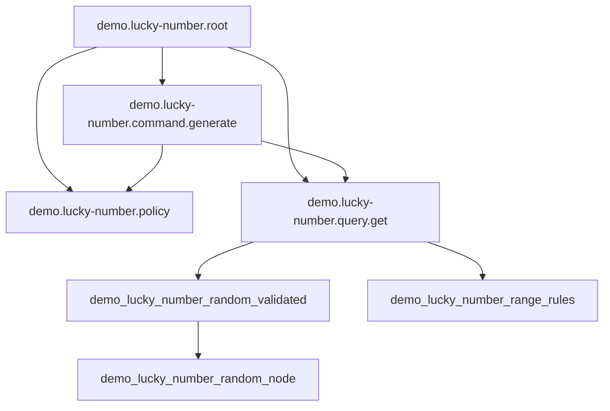

<!-- Generated by Winzard Forge. -->
<!-- Source: explicit composition.definition.ts contracts. -->
<!-- Do not edit directly. -->

# Composition graph

Composition SHA-256: `0c83d7a398983413b41b85c118705bb4a5d68ac3ce1058890220de62de5f6627`

