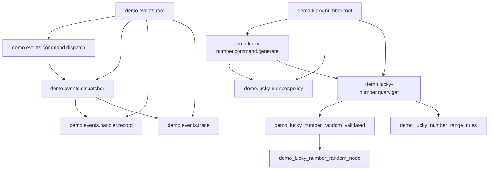

<!-- Generated by Winzard Forge. -->
<!-- Source: explicit composition.definition.ts contracts. -->
<!-- Do not edit directly. -->

# Composition graph

Composition SHA-256: `9f9c910c320820abbd1cf3225b53a8dad40472ce9c48cde07cb485d644b93a9d`

