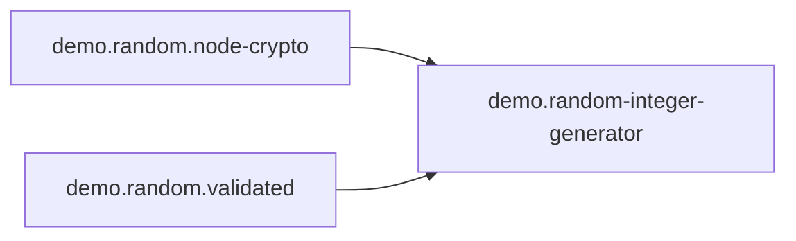

<!-- Generated by Winzard Forge. -->
<!-- Source: contract and provider inventory. -->
<!-- Do not edit directly. -->

# Contract graph

Contract SHA-256: `0ed7f85d039421914faa99227f18bd5528ee2237333f5e35267641b99ad45dee`

