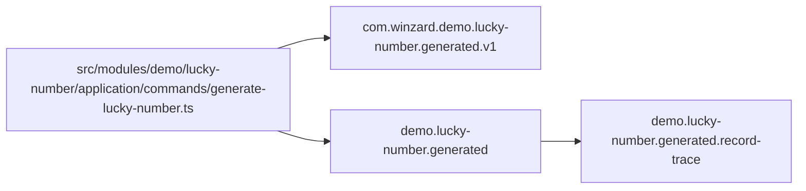

<!-- Generated by Winzard Forge. -->
<!-- Do not edit directly. -->

Event registry SHA-256: `ce6b3fcdb7b5285fc5116b493f044153ee950876b20db3ab669b1309b80c0fa4`

# Event graph

```mermaid
graph LR
  src_modules_demo_lucky_number_application_commands_generate_lucky_number_ts["src/modules/demo/lucky-number/application/commands/generate-lucky-number.ts"] --> com_winzard_demo_lucky_number_generated_v1["com.winzard.demo.lucky-number.generated.v1"]
  src_modules_demo_lucky_number_application_commands_generate_lucky_number_ts["src/modules/demo/lucky-number/application/commands/generate-lucky-number.ts"] --> demo_lucky_number_generated["demo.lucky-number.generated"]
  demo_lucky_number_generated --> demo_lucky_number_generated_record_trace["demo.lucky-number.generated.record-trace"]
```
