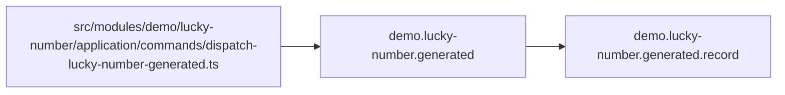

<!-- Generated by Winzard Forge. -->
<!-- Do not edit directly. -->

Event registry SHA-256: `5fb6332c9647bf987b7ee034a8200eeb70ae301c1b4fe4fb24ab626a9815a750`

# Event graph

```mermaid
graph LR
  src_modules_demo_lucky_number_application_commands_dispatch_lucky_number_generated_ts["src/modules/demo/lucky-number/application/commands/dispatch-lucky-number-generated.ts"] --> demo_lucky_number_generated["demo.lucky-number.generated"]
  demo_lucky_number_generated --> demo_lucky_number_generated_record["demo.lucky-number.generated.record"]
```
