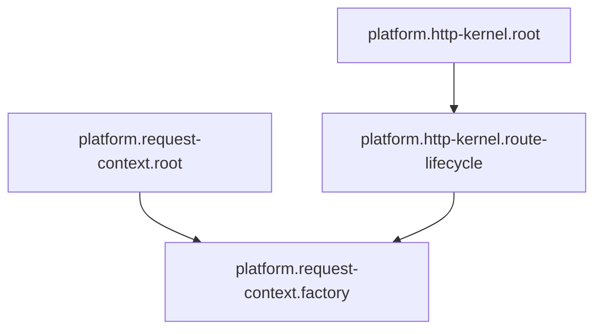

<!-- Generated by Winzard Forge. -->
<!-- Source: explicit composition.definition.ts contracts. -->
<!-- Do not edit directly. -->

# Composition graph

Composition SHA-256: `9fe8dfe15cb94e37154fea81b80567a2e0666a898e684a56bab47eebfc952059`

