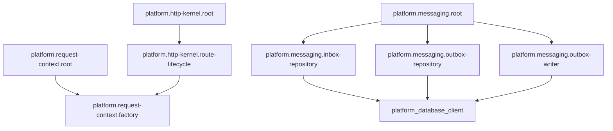

<!-- Generated by Winzard Forge. -->
<!-- Source: explicit composition.definition.ts contracts. -->
<!-- Do not edit directly. -->

# Composition graph

Composition SHA-256: `e7bf519d53e22f21109a728b734bd09bcc3f507ef44d6ae676fff373e560553b`

