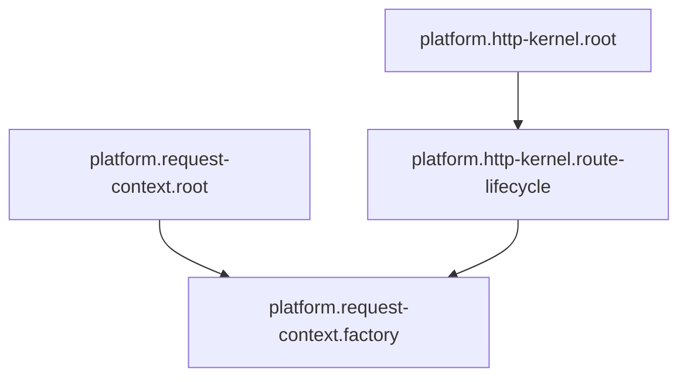

<!-- Generated by Winzard Forge. -->
<!-- Source: explicit composition.definition.ts contracts. -->
<!-- Do not edit directly. -->

# Composition graph

Composition SHA-256: `b02d59cb7fda51f57e58a7862a4bc15f577c16ea73e2032a7689b3f95f3c2ae6`

